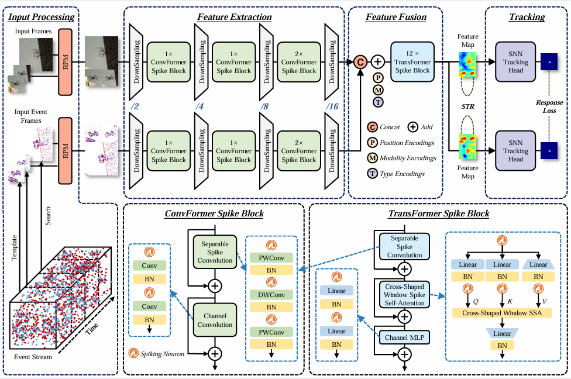

# SpikeFET

A unified framework for Spiking Frame-Event Tracking. 

<p align="center">
  
</p>

[[Models](https://drive.google.com/drive/folders/1JlVOSm1dZM0_RjcwQ6bqdLa4JBBwPtGz?usp=sharing)] Google Driver
[[Models](https://pan.baidu.com/s/1EqzsPJl31m27CLUDinFm1A?pwd=tp8a)] Baidu Driver Passcode：tp8a

[[Raw Results](https://drive.google.com/drive/folders/1wTJX9MEdt7qwpSrKtwbAj9ZdMnIrnLFq?usp=drive_link)] Google Driver
[[Raw Results](https://pan.baidu.com/s/1UkT3aRT8t-2bOJCQUthWdQ?pwd=tqmi)] Baidu Driver Passcode：tqmi


It consist of the following folds:

```
-SpikeFET
--experiments: the config files about training and testing.
--lib: details about model and training
--scripts: many scripts for dataset preprocess.
--tracking: tracking and evaluation scripts.
```

<table>
  <tr>
    <th>Model</th>
    <th>Power<br>mJ</th>
    <th>FE108<br>AUC (%)</th>
    <th>VisEvent<br>AUC (%)</th>
    <th>COESOT<br>AUC (%)</th>
  </tr>
  <tr>
    <td>SpikeFET-Tiny</td>
    <td>18.36</td>
    <td>68.5</td>
    <td>56.8</td>
    <td>64.0</td>
  </tr>
  <tr>
    <td>SpikeFET-Base</td>
    <td>102.61</td>
    <td>68.7</td>
    <td>59.0</td>
    <td>68.5</td>
  </tr>
  <tr>
    <td>SpikeET</td>
    <td>8.80</td>
    <td>64.4</td>
    <td>39.4</td>
    <td>-</td>
  </tr>
</table>

Install env
```
conda create -n spikefet python=3.8
conda activate spikefet
bash install.sh
```

Run the following command to set paths for this project
```
python tracking/create_default_local_file.py --workspace_dir . --data_dir ./data --save_dir ./output
```

After running this command, you can also modify paths by editing these two files
```
lib/train/admin/local.py  # paths about training
lib/test/evaluation/local.py  # paths about testing
```

Then, put the tracking datasets [FE108](https://zhangjiqing.com/dataset/)、[VisEvent](https://github.com/wangxiao5791509/VisEvent_SOT_Benchmark)、[COESOT](https://github.com/Event-AHU/COESOT) in `./data`. 

Download pre-trained [SpieFET-Tiny weights](https://drive.google.com/file/d/1J9197drVOrMHbtJFUm-49XYDVwb9i8x6/view?usp=drive_link)、 [SpikeFET-Base weights](https://drive.google.com/file/d/1qGZOeoD-TunZXomBleJsujOk1_cRHOyJ/view?usp=drive_link) and put it under `$/pretrained_models`

Download the [Models weights](https://drive.google.com/drive/folders/1JlVOSm1dZM0_RjcwQ6bqdLa4JBBwPtGz?usp=sharing) and put it on `$/output/checkpoints/train/spikefet`

## Train
```
# train
python tracking/train.py --script spikefet --config spikefet_visevent_base  \
--save_dir ./output --mode multiple --nproc_per_node 1 --use_wandb  0
bash train_fe108.sh
bash train_visevebt.sh
bash train_coesot.sh
```
## Test & Evaluation
### For FE108 benchmark
```
# test
bash eval_fe108_base.sh
or
python tracking/test.py spikefet spikefet_fe108_base --dataset fe108 --threads 4 --num_gpus 1 --ckpt \
./output/checkpoints/train/spikefet/spikefet_fe108_base/SpikeFET_FE108_Base.pth
# eval
python tracking/analysis_results.py --dataset spikefet --parameter_name spikefet_fe108_base
````
### For Visevet benchmark
[For Frame-Event]\
Modify the <DATASET_PATH> and <SAVE_PATH> in```./VisEvent_workspace/test_visevent_mgpus.py```, then run:
```
bash eval_visevent_base.sh
```
[For Event]
```
bash eval_visevent_spikeet.sh
or
python tracking/test.py spikefet spikeet_visevent --dataset visevent --threads 4 --num_gpus 1 --ckpt \
./output/checkpoints/train/spikefet/spikeet_visevent/SpikeET_VisEvent.pth
```
We refer you to [VisEvent_SOT_Benchmark](https://github.com/wangxiao5791509/VisEvent_SOT_Benchmark) for evaluation.

### For COESOT benchmark
```
bash eval_coesot_base.sh
or
python tracking/test.py spikefet spikefet_coesot_base --dataset coesot --threads 4 --num_gpus 1 --ckpt \
./output/checkpoints/train/spikefet/spikefet_coesot_base/SpikeFET_COESOT_Base.pth
```
We refer you to [COESOT_eval_toolkit](https://github.com/Event-AHU/COESOT) for evaluation.

### Test FLOPs, and Speed
```
# Profiling spikefet_visevent
python tracking/profile_model.py --script spikefet --config spikefet_visevent_base
```
## Acknowledgments

* Thanks for the [CEUTrack](https://github.com/Event-AHU/COESOT) and [E-SpikeFormer](https://github.com/BICLab/Spike-Driven-Transformer-V3) library, which help us to quickly implement our ideas.
